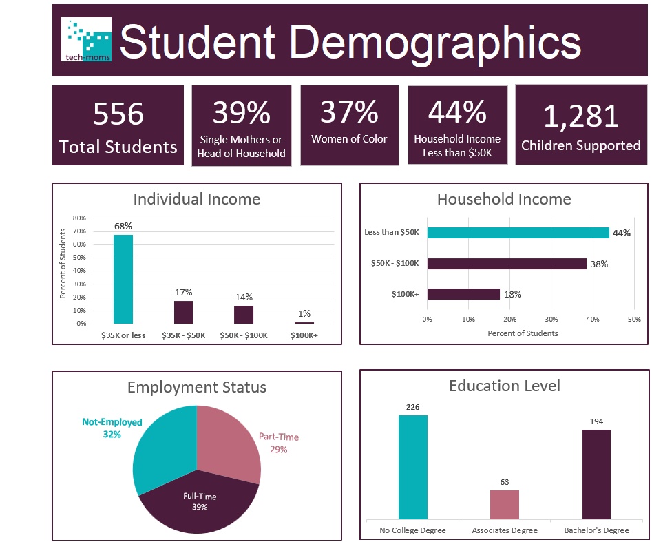

  
# Tech Mom's Demographics Analysis

## Project Overview
This data analysis project was completed as part of **Tech-Mom's Data Analysis & AI Program**. The objective was to clean, structure, and analyze student demographic data (as of July 31, 2024) to support data-driven insights.

The dashboard visualizes key metrics regarding student demographics, financial background, household structures, and baseline education to showcase the impact of Tech-Moms' initiatives to donors and community stakeholders.

---

## Key Insights & Takeaways

* **Driving Economic Security:** With **68% of students earning $35K or less** and **44% in households earning under $50K**, Tech-Moms is reaching the a demographic that stands to gain the most upward economic mobility from high-paying tech careers.
* **Creating Generational Impact:** Serving **39% single mothers/heads of households** and supporting **1,281 children** shows that Tech-Moms' training benefits entire family units with the potential for multi-generational impact.
* **Breaking Down Barriers to Tech:** By serving **37% Women of Color** and **over 40% of students without a college degree**, the program successfully creates accessible, alternative pathways into the tech pipeline for underrepresented talent

---

## Project Structure & Data Workflow

1. **Data Cleaning & Filtering:** Filtered raw applicant records strictly to include active entries up to July 31, 2024, removing post-cutoff dates and deduplicating records in Excel.
2. **Data Dictionary:** Built a transposed schema defining all original survey columns to standardize data definitions.
3. **Statistical Functions:** Utilized Excel formulas (`COUNTIF`, `AVERAGEIF`, `SUM`, `MAX`) to calculate precise total counts, average child metrics, and key demographic ratios.
4. **Pivot Tables & Visualizations:** Dynamic data summarization using pivot tables, calculated fields, and custom charts designed around Tech-Moms brand colors.
5. **Stakeholder Alignment:** Documented data clarification queries for leadership within a dedicated tab for transparency.

---

## Repository File Directory

* `TechMoms-Demographics-Data-Analysis.xlsx` — Full Excel workbook containing the original data, data dictionary, cleaned analysis sheet, dynamic pivot tables, leadership question log, and final interactive dashboard layout.
* `TechMoms-Demographics-Dashboard.png` — High-resolution screenshot of the finalized dashboard layout.

---

## Tools
* **Spreadsheet Software:** Microsoft Excel (Pivot Tables, Functions, Conditional Formatting, Data Visualization)
